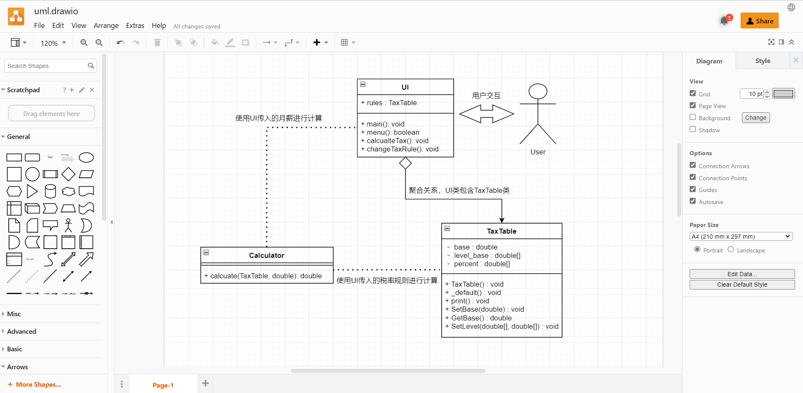

### LabWeek01 Preparations

##### 熟悉机房工作环境（硬件平台、软件平台）

机房硬件平台为x86

软件平台为windows

##### 熟悉任务管理平台 matrix

matrix域名为 matrix.sysu.edu.cn

之前用它提交过其它课程（程序设计、数据结构）的作业，所以已经较为熟悉

##### 熟悉draw.io（在线工具）或其它画图工具

尝试使用draw.io画UML图，效果如下

##### 熟悉一个markdown编辑器（可能需要自行下载安装）

使用markdown编辑器Typora。

它是一个风格极简的编辑器，支持macOS, windows，Linux等环境，支持实时预览等功能。并支持导出为pdf，html等格式。

##### 建立一个本课程任务的git仓库

已建立，地址为[4yue/software-engineering (github.com)](https://github.com/4yue/software-engineering)（已设置为public），现已上传第一次作业有关文件

